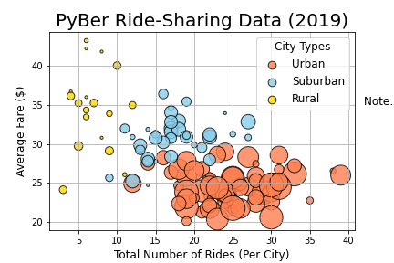
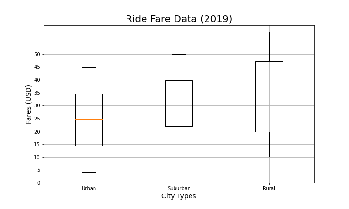
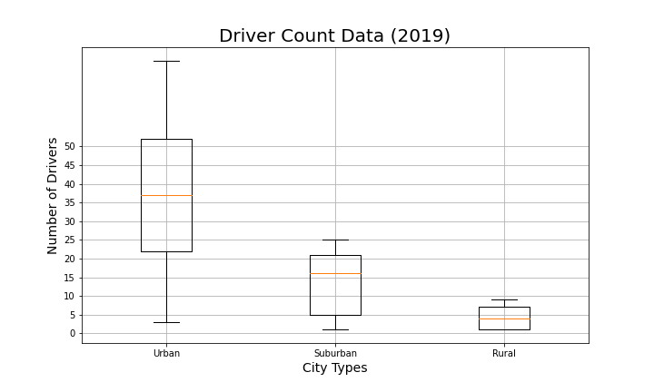

# PyBer Analysis

## OVERVIEW OF THE PROJECT

### Description:

In this project we will be performing an exploratory analysis on large csv files.   We will analyze all the rideshare data of PyBer, a ride-sharing app company, from **January to April of 2019** and create a compelling visualizations for the CEO to help drive strategy.

### Purpose:

The purpose of the analysis is to create visualizations of rideshare data for PyBer to help improve access to ride-sharing services and determine affordability for underserved neighborhoods.

### Current situation:

PYber is a python based ride-sharing app company valued at $2.3 billion.  The CEO of the company needs the analysis to make strategic decisions regarding affordability for certain neighborhoods.

### Overview of approach:

Using Pandas library, Jupiter Notebook, and Matplotlib we were able to read, merge, and create visualizations of two large csv files located on the Resources folder; city_data.csv and ride_data.csv. The charts created show the relationship between the type of city and drivers, riders, and fares.  These visualizations are located on the analysis and Resources folders and consist of line charts, bubble charts, Box-and-Whisker plots, and Pie charts. The code used can be found in the file PyBer_Challenge.ipynb

## ANALYSIS AND RESULTS

**1. Revenue Throughout Time :**  

In the following graph we can observe how our main revenue stream comes from services provided in **Urban cities**, following by Suburban, and rural.  In the **third week of February** we can observe a significant increase in revenue along the three types of cities.  Regarding the overall increase throughout time; from January to April, **Urban cities show an overall increase in revenue as time passes** despite some variations.  Revenue coming from Suburban cities has remained steady with a tendency to increase. Finally, the rural cities' revenue has had some lows and highs but in general is steady.

**2. Number of Rides provided in relationship with Fare:**

In the graph, the size of the bubbles represent the number of drivers per city.  We can observe that **Urban cities have the greatest number of drivers**, followed by Suburban and Rural.  Also, Fares tend to be lower as the Number of Rides provided increases.  **The majority of Rides provided are in Urban cities and also they have the lowest Fares.**. Finally, **it is interesting how Rural cities have the lowes number of drivers available, the highest Fares, and the least rides provided.**

**3. Number of Rides by City Type:**

Looking at the box-and-whisker plot we can describe the comparison as follows:

-Comparison of location: The figure shows that **the median number of rides provided in Urban cities is greater than that of those in Suburban cities and Rural cities**. Meaning that 50% of the rides are 24, 17, and 6 for Urban, Suburban, and Rural cities respectively.

-Comparison of dispersion: The overall range of the data set is greater for the Urban cities (as shown by the distances between the ends of the two whiskers for each boxplot), followed by Suburban and Rural respectively. This means that **the number of rides in Urban cities may vary in greater scale than Suburban and Rural.** 

The minimun and maximum number of rides are as follows respectively:
Urban:12 and 39
Suburban: 9 and 27
Rural: 3 and 13

-Comparison of potential outliers: There is at least one outlier in the Urban cities, which is close to 40.

4. 

5. 

6. 

7. 

8. 

## RECOMMENDATIONS

1.
2. 
3. 
