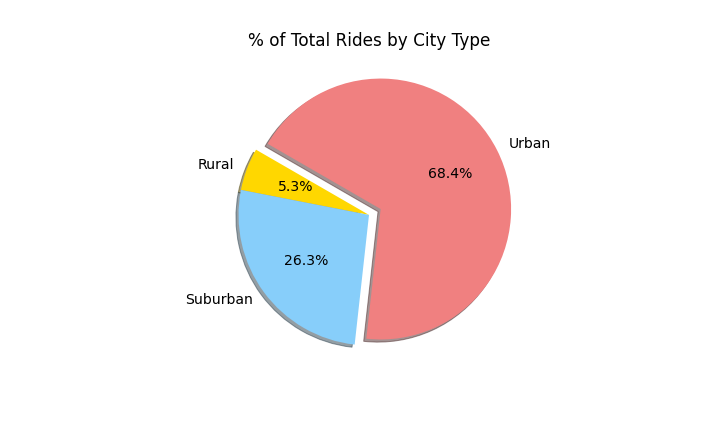

# PyBer Analysis

## OVERVIEW OF THE PROJECT

### Description:

In this project we will be performing an exploratory analysis on two large csv files.   We will analyze all the rideshare data of PyBer, a ride-sharing app company, from **January to April of 2019** and create a compelling visualizations for the CEO to help drive strategy.

### Purpose:

The purpose of the analysis is to create visualizations of rideshare data for PyBer to help improve access to ride-sharing services and determine affordability for underserved neighborhoods.

### Current situation:

PYber is a python based ride-sharing app company valued at $2.3 billion.  The CEO of the company needs the analysis to make strategic decisions regarding affordability for certain neighborhoods.

### Overview of approach:

Using Pandas library, Jupiter Notebook, and Matplotlib we were able to read, merge, and create visualizations of two large csv files located in the Resources folder; city_data.csv and ride_data.csv. The charts created show the relationship between the type of city and drivers, riders, and fares.  These visualizations are located on the analysis and Resources folders and consist of line charts, bubble charts, Box-and-Whisker plots, and Pie charts. The code used can be found in the file PyBer_Challenge.ipynb

## ANALYSIS AND RESULTS

**1. Revenue Throughout Time :**  

In the following graph we can observe how our main revenue stream comes from services provided in **Urban cities**, followed by Suburban, and rural respectively.

In the **third week of February** we can observe a significant increase in revenue along the three types of cities.  

**Urban cities show the largest overall increase in revenue from January through April**.  Revenue coming from Suburban cities has remained steady with a tendency to increase. Finally, **the rural cities' revenue has not increased**.

**2. Number of Rides in relationship with Fare:**

In the following graph, the size of the bubbles represent the number of drivers per city.  In the X-axis are the number of rides by city and in the Y-axis are the fares.  

We can observe that **Urban cities have on average the greatest number of drivers**, and **Rural the smallest**.  

Despite that **Urban** cities have the greatest number of rides **their fares are the lowest** among the three. 

Finally, **Rural cities have the lowest number of drivers, significantly higher fares compared to Urban cities, and the least rides**.

**3. Number of Rides by City Type:**

Looking at the box-and-whisker plot we can see that **the median number of rides for city type** are:
Urban cities 24,
Suburban 17, 
Rural (6). 

**Urban cities** show the highest distance between the ends of the three whiskers for each boxplot.  This means that the **range of the data** for Urban cities is the **largest**.  The minimun rides observed for Urban cities is 12 and the maximum 39. Finally, there is at least one outlier in the Urban cities, which is close to 40.

In the time analyzed **Rural cities** have **the smallest number of rides per city** and therefore a narrower range. Minimum number of rides observed is 3 and maximum 13.

The minimum rides observed in Suburban cities is 9 and the maximum 27.

**4. Ride Fare by City Type:**

The Ride Fare data for Urban and Suburban show a very **similar distribution**. The interquartile ranges are reasonably similar (as shown by the lengths of the boxes). 

The **overall range** of the data set is **the greatest for the Rural cities** (as shown by the distances between the ends of the three whiskers for each boxplot). Fares have been as low as $10 and as high as $60.

The **median Ride Fare of Rural cities** is $37 making it **the highest** among the three.  

The median Ride Fare of Suburban cities is $31 

The median Ride Fare of Urban cities is $24 

**5. Driver Count by City Type:**

Rural cities shows the smallest driver count follwed by Suburban and lastly Urban.

The number of drivers in the Urban cities is more than four times the drivers in Rural cities.  Rural cities' driver count has been as low as 1 per city and as high as 9. 

**6. Fare Percentage, Ride Percentage, and Driver Percentage by City Type:**

In the next three graphs we can observe that Urban cities represent the greatest participation among the three categories, followed by Suburban, and lastly Rural.

## SUMMARY

1. **Average fare price per city type**

Urban    $24.53, 
Suburban $30.97, 
Rural    $34.62.

2. **Average number of Drivers per city** 

Urban    37, 
Suburban 14, 
Rural     4.

3. **Average Number of Rides per City**

Urban    25, 
Suburban 17,  
Rural     7. 

4. **Total rides** 

Urban 1,625, 
Suburban  625, 
Rural 125.

5. **Total drivers** 

Urban       2,405,
Suburban      490, 
Rural          78. 

6. **Total fares ($USD)**

Urban       $39,854,
Suburban    $19,356,
Rural        $4,327.

## RECOMMENDATIONS

current ridesharing model—a model that serves primarily adult, metropolitan-area riders traveling alone or in small groups

heavy turnover in ridesharing drivers, which further strains leading players who often fall short of double-digit margins

research suggests that a number of advances, particularly smarter design, improved user experience, and the application of advanced analytics, can create more purpose-built solutions and more favorable economics. These changes (Ridesharing 2.0 and 3.0, if you will) would encourage a broader population to use ridesharing in a wider range of circumstances and help the industry attract and keep more drivers, which would improve the business’ economics significantly. 
elderly users enjoyed a new sense of freedom, reporting that they have come to use ridesharing for doctor appointments, errands, and visits to friends without having to rely on family or caregivers for transportation.
The rural market, for example, comprises 25 percent of underserved use cases, and customers far outside of cities are likely to remain beyond ridesharing’s core for a while.
e seen how far ridesharing can go in making itself sufficiently attractive to capture additional use cases
 importance of experience to riders suggest that smarter, more user-friendly interior design that makes the ridesharing experience more attractive could be one powerful means of increasing rideshare penetration. The solutions relevant for solo trips and small groups of travelers (such as shoppers and families, which together comprise 18 percent of underserved US VMT) can be implemented almost immediately and address several of the most common instances in which people use an automobile. 

**1. Big data and advanced analytics as a priority to drive decision making:**

We recommend to perform not only descriptive analytics but also predictive analytics. Predictive analytics will allow PyBer to find patterns across different cities to help predict demand and be prepared to respond to it.  For example, patterns can be found in working, residential, and student locations, destinations, routes, and type of service in certain hours of the day. 

**2. Invest in the drivers will help PyBer grow the customer base and attend underserved areas:** 

As we saw in our analysis, Rural cities are underserved and the fares are high in comparison with the other types of cities.  We see an opportunity to grow this segment by increasing PyBer's driver availability and make fare price more affordable. In order to increase the number of drivers in this type of cities and grow the Rural consumer base, we recommend understanding the needs of the drivers and investing in them.  For example, having more versatile car interior designs that allow drivers to serve different types of consumer needs; having cars with foldable chairs for consumers that need to transport large amounts of goods, cases for food delivery, easy to install and uninstall car seats for families traveling with kids, electricity plugs and wifi for students and working professionals.  A second example is related to security, some drivers might be afraid to drive at certain hours of the night or pick up riders on .  PyBer might consider investing in security cameras inside and outside the car, and emergency buttons with GPS car locators connected to the closest police station.
These examples could also be applied to the other types of cities.

**3. Segment ride-share customer persona and develop targeted marketing campaigns to grow Baby boomers, Millenials, and Gen-z users in urban cities:**

Despite the fact that Fare prices are lower in urban cities, the volume of rides makes this city type the highest source of revenue for PyBer.  According to our research on the ride-share industry, there is opportunity to grow in Urban cities for targeted consumers.  For example, older adults who want to be independent and go to medical appointmets, small groups of young professionals 

segmenting the needs of our drivers and consumers to 

 

2. Attract broader population of drivers for Rural cities by attracting more Rural consumers:

Make it more affordable and available

3. 
